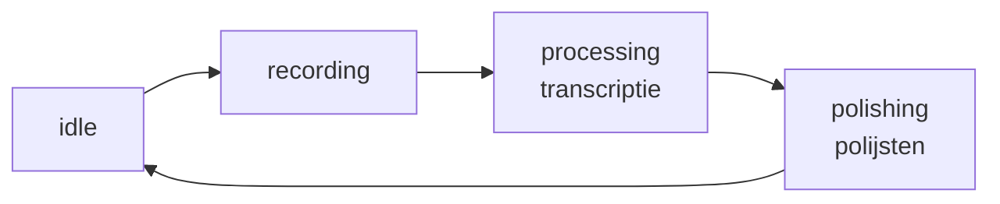

# Architectuur

## App Flow



- **idle**: klaar voor opname of bestandsupload
- **recording**: microfoon actief, waveform visualisatie, optioneel live transcriptie
- **processing**: audio → tekst (Whisper lokaal of AssemblyAI)
- **polishing**: ruwe tekst → gepolijst Nederlands (Ollama lokaal of Mistral)
- Daarna terug naar idle, met ruwe + gepolijste tekst zichtbaar

## Data Flow

```
Services (side effects) → Store (state management) → Components (UI)
```

- **Services** (`src/lib/services/`): opname, transcriptie, polijsten, waveform — alle side effects (fetch, MediaRecorder, SSE)
- **Store**: `transcribe.svelte.ts` — enige bron van waarheid, Svelte 5 runes, getter-object pattern via `getTranscribeState()`
- **Components**: presentationeel, geen eigen app-state — lezen via de store, muteren via exported setters
- **Utils** (`src/lib/utils/`): pure functies en de analytics wrapper

## Verwerkingsmodi

Gebruiker kiest per stap tussen lokaal en API:

| Stap         | Lokaal                                | API                                 |
| ------------ | ------------------------------------- | ----------------------------------- |
| Transcriptie | mlx-whisper (large-v3, Apple Silicon) | AssemblyAI (Universal-2, EU Dublin) |
| Polijsten    | Ollama/Gemma3                         | Mistral AI (EU servers)             |

### Backend (FastAPI, poort 8000)

- `GET /health` — health check + beschikbaarheid lokaal/API
- `POST /transcribe` — audio → Whisper (30s segmenten, SSE stream)
- `POST /transcribe-live` — audio → Whisper (incrementeel, offset filtering)
- `POST /polish` — tekst → Ollama of Mistral (SSE token stream)
- `WS /ws/transcribe-stream` — real-time WebSocket streaming via AssemblyAI

### SvelteKit API routes (`src/routes/api/`)

- AssemblyAI: submit + poll (transcriptie via EU datacenter)
- Mistral: polijsten via EU servers

## Routing

- `+layout.svelte`: analytics init, globale UI (background, cookie banner)
- `/` (`+page.svelte`): redirect naar `/transcribe`
- `/transcribe`: de hoofd-app — opname, transcriptie, polijsten

## Audio Processing

- Browser: MediaRecorder API + Web Audio API (waveform visualisatie)
- Downsampling naar 16kHz mono WAV voor Whisper
- Live transcriptie: incrementeel (alleen nieuwe chunks + 3s overlap)
- Lange teksten gechunkt (max 400 woorden per chunk)
- Max 3 parallelle Ollama requests (semaphore)

## Analytics

- PostHog (EU endpoint, `person_profiles: 'never'`)
- Alle events via `src/lib/utils/analytics.ts` wrapper
- Try/catch — analytics mag nooit de app breken
- Nooit transcriptie-inhoud loggen, alleen metadata (duur, woordenaantal, modus)
